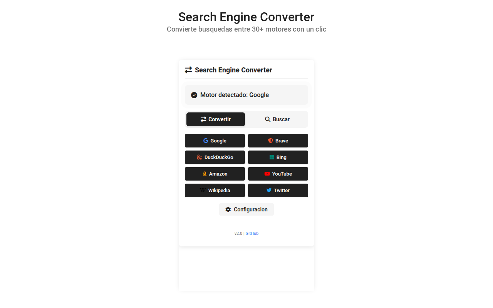
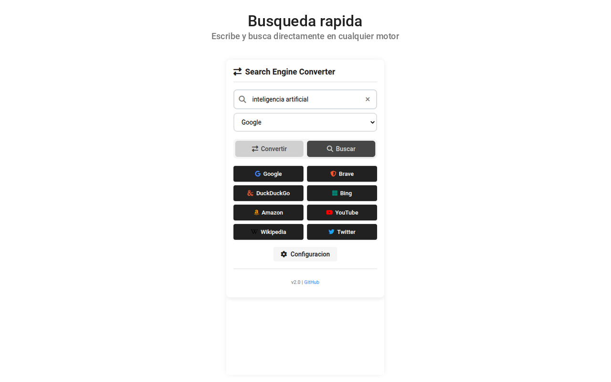
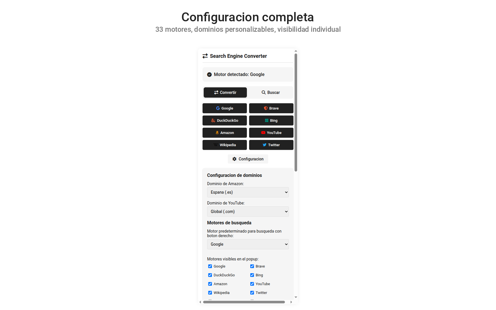
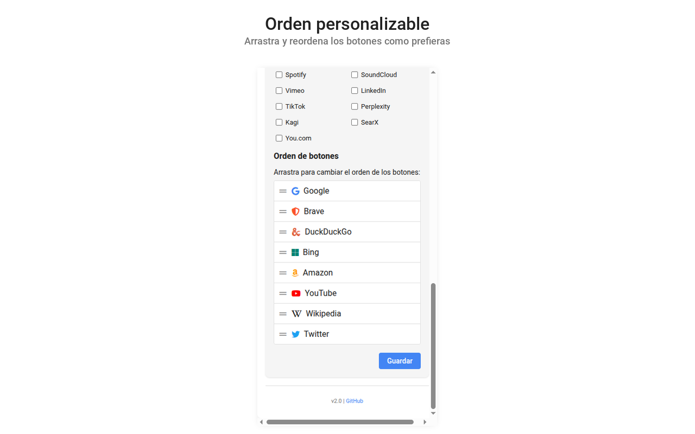
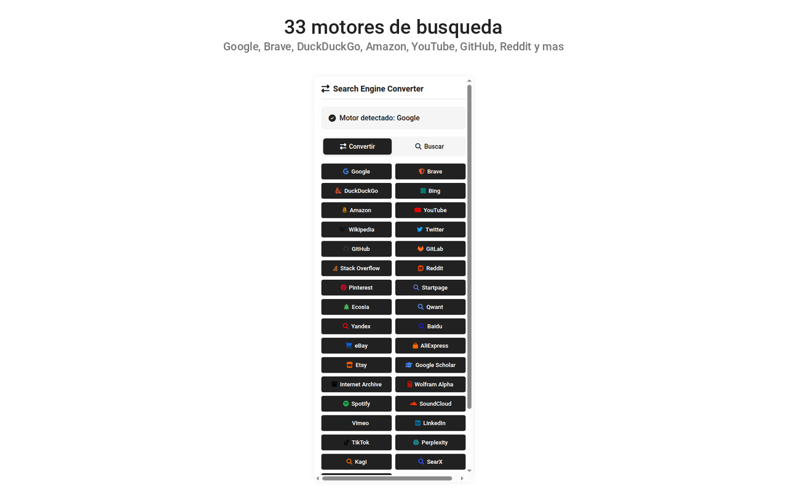

# Search Engine Converter v2.2.0

Extensión para navegadores Chromium que convierte búsquedas entre 33 motores diferentes manteniendo los términos exactos. Compatible con Chrome, Brave y Edge.

[](https://github.com/686f6c61/chrome-search-engine-converter)
[](https://github.com/686f6c61/chrome-search-engine-converter)
[](https://github.com/686f6c61/chrome-search-engine-converter)
[](https://github.com/686f6c61/chrome-search-engine-converter)
[](LICENSE)

---

## Capturas de pantalla

### Interfaz principal


Vista principal con motor detectado y botones de conversión en grid de 2 columnas.

### Búsqueda rápida


Modo búsqueda con campo de texto y selector de motor para buscar directamente.

### Configuración


Panel de configuración con dominios regionales, visibilidad de motores y checkboxes individuales.

### Orden personalizable


Drag-and-drop para reordenar los motores en el popup.

### Todos los motores


Los 33 motores de búsqueda soportados.

---

## Funcionalidades

- **Conversión instantánea**: detecta automáticamente el motor de búsqueda actual y permite convertir a cualquier otro motor soportado
- **33 motores**: Google, Brave, DuckDuckGo, Bing, Amazon, YouTube, Wikipedia, X (Twitter), GitHub, GitLab, Stack Overflow, Reddit, Pinterest, Startpage, Ecosia, Qwant, Yandex, Baidu, eBay, AliExpress, Etsy, Google Scholar, Internet Archive, Wolfram Alpha, Spotify, SoundCloud, Vimeo, LinkedIn, TikTok, Perplexity, Kagi, SearXNG, You.com
- **Búsqueda rápida**: escribe un término y busca en cualquier motor sin necesidad de navegar a su página
- **Menú contextual mejorado**: acción rápida con motor predeterminado + submenú completo para elegir cualquier motor
- **Detección de imágenes**: si estás en búsqueda de imágenes, la conversión mantiene el modo imágenes
- **Copiar URL**: copia la URL convertida al portapapeles sin abrir nueva pestaña
- **Atajos de teclado**: Alt+1-9 conversión directa, Ctrl/Cmd+K búsqueda rápida, ESC cerrar popup
- **Atajos globales**: Ctrl/Cmd+Shift+S convierte la búsqueda actual al motor predeterminado sin abrir el popup (configurable en `chrome://extensions/shortcuts`)
- **Personalización**: motores visibles, orden drag-and-drop, dominios regionales (Amazon, YouTube)
- **Exportar/importar configuración**: guarda tus preferencias como JSON y restáuralas en otra instalación
- **Modo oscuro**: se adapta automáticamente al tema del sistema (`prefers-color-scheme: dark`)
- **Accesibilidad**: navegación completa por teclado, ARIA labels, soporte para lectores de pantalla, respeto a `prefers-reduced-motion`

---

## Instalación

### Desde código fuente (modo desarrollador)

```bash
git clone https://github.com/686f6c61/chrome-search-engine-converter.git
```

1. Abrir `chrome://extensions/` (o `brave://extensions/` o `edge://extensions/`)
2. Activar "Modo de desarrollador"
3. Pulsar "Cargar extensión sin empaquetar"
4. Seleccionar la carpeta `extension/`

### Desde Chrome Web Store

*(Pendiente de publicación)*

---

## Tests

```bash
npm test
```

Ejecuta los tests con el runner nativo de Node.js (`node:test`). Los tests verifican el registro de motores, funciones de búsqueda, validación de dominios, detección de motores y casos edge (URLs malformadas, dominios inválidos).

### Cobertura

```bash
npm run test:coverage
```

### Lint

```bash
npm run lint
```

ESLint con reglas de seguridad (no-eval, no-implied-eval, eqeqeq) y prevención de bugs (no-undef, no-redeclare).

### Build del ZIP para Web Store

```bash
npm run build
```

Genera `dist/search-engine-converter-v<version>.zip` con solo el contenido de `extension/`, listo para subir a la Chrome Web Store.

---

## Estructura del proyecto

```
chrome-search-engine-converter/
  .github/
    workflows/
      ci.yml                 # CI: lint + tests + build ZIP + artifact
  extension/
    _locales/
      es/messages.json       # Mensajes en español (i18n)
      en/messages.json       # Mensajes en inglés (i18n)
    manifest.json            # Manifest V3, permisos mínimos, i18n
    engines.js               # Registro centralizado de 33 motores (SSOT)
    background.js            # Service Worker (menú contextual + atajos globales)
    popup.html               # Interfaz del popup (esqueleto mínimo)
    popup.js                 # Controlador del popup (genera HTML dinámico)
    popup.css                # Estilos del popup (con modo oscuro)
    Sortable.min.js          # Librería drag-and-drop (local, 45 KB)
    privacy-policy.html      # Política de privacidad (versión Web Store)
    css/
      fontawesome.min.css    # Font Awesome 6 subset (37 iconos, 6.5 KB)
      fonts.css              # Declaraciones @font-face
    fonts/
      fa-solid-900.woff2     # Iconos sólidos (subset)
      fa-brands-400.woff2    # Iconos de marcas (subset)
      roboto-{400,500,700}.woff2  # Fuente Roboto
    images/
      icon{16,32,48,128,256}.png  # Iconos en todos los tamaños
  scripts/
    build-zip.mjs            # Empaquetado a ZIP para Web Store
  tests/
    engines.smoke.test.cjs   # Tests de funciones críticas (58 tests)
  docs/
    audits/
      AUDIT-2026-03-05.md    # Auditoría técnica completa
  .editorconfig              # Consistencia de indentación entre editores
  .gitignore
  eslint.config.js           # ESLint flat config (reglas de seguridad)
  SECURITY.md                # Política de reporte de vulnerabilidades
  CONTRIBUTING.md            # Guía de contribución
  package.json               # Scripts de validación, lint, build
  LICENSE                    # MIT License
  README.md
  CHANGELOG.md
  PRIVACY_POLICY.md          # Política de privacidad completa
```

### Arquitectura

- **engines.js** es la única fuente de verdad (SSOT) para todos los motores. Define configuración, URLs, patrones de detección y funciones de búsqueda/extracción. Lo consumen tanto `background.js` como `popup.js` mediante `importScripts()` y `<script>`.
- **popup.js** genera todo el HTML dinámicamente desde `SEARCH_ENGINES` - botones, checkboxes, selects, lista de orden.
- **background.js** crea los menús contextuales, gestiona las búsquedas desde el clic derecho y los atajos de teclado globales (`chrome.commands`).
- **_locales/** contiene los mensajes internacionalizados (i18n) en español e inglés. El manifest usa `__MSG_*__` para traducir nombre y descripción.
- **Cero dependencias externas**: fuentes, iconos y Sortable.min.js están empaquetados localmente. No se carga ningún recurso remoto.

---

## Privacidad y seguridad

- **Sin recopilación de datos**: no se envía información a servidores externos
- **100% local**: toda la lógica se ejecuta en el navegador
- **Sin analíticas**: no se usa Google Analytics ni ningún servicio de telemetría
- **Código abierto**: todo el código está disponible para auditoría

### Permisos (4 permisos mínimos)

| Permiso | Uso |
|---------|-----|
| `activeTab` | Lee la URL de la pestaña activa para detectar el motor y extraer el término de búsqueda |
| `contextMenus` | Crea el menú de clic derecho para buscar texto seleccionado |
| `storage` | Guarda preferencias del usuario localmente |
| `omnibox` | Permite buscar desde la barra de direcciones con el keyword `sc` |

### Content Security Policy

```json
"content_security_policy": {
  "extension_pages": "script-src 'self'; object-src 'none'; style-src 'self'; font-src 'self'; img-src 'self';"
}
```

Solo se permite cargar recursos locales (`'self'`). Sin `unsafe-inline`, sin `data:`, sin CDN externos.

---

## Motores soportados

| Categoría | Motores |
|-----------|---------|
| Generalistas | Google, Brave, DuckDuckGo, Bing, Startpage, Ecosia, Qwant, Yandex, Baidu |
| IA | Perplexity, You.com |
| Privacidad | Kagi, SearXNG, Startpage |
| Redes sociales | X (Twitter), Reddit, LinkedIn, Pinterest, TikTok |
| Multimedia | YouTube, Spotify, SoundCloud, Vimeo |
| Comercio | Amazon, eBay, AliExpress, Etsy |
| Desarrollo | GitHub, GitLab, Stack Overflow |
| Académico | Wikipedia, Google Scholar, Internet Archive, Wolfram Alpha |

---

## Licencia

[MIT License](LICENSE) - [@686f6c61](https://github.com/686f6c61)

## Enlaces

- [Política de privacidad](PRIVACY_POLICY.md)
- [Changelog](CHANGELOG.md)
- [Guía de contribución](CONTRIBUTING.md)
- [Política de seguridad](SECURITY.md)
